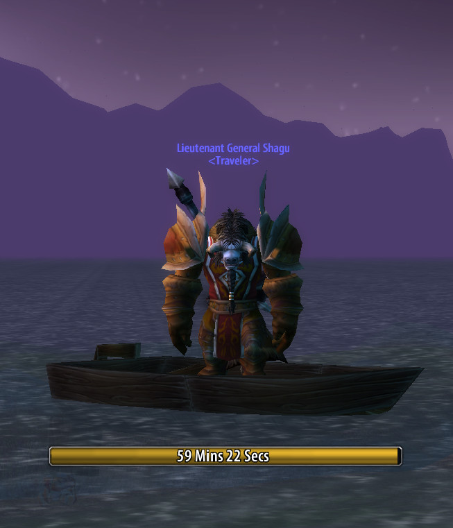

# ShaguBoat

A small addon for World of Warcraft: Vanilla (1.12.1) that helps to track your fishing boat timeout on [Turtle WoW](https://turtle-wow.org/).
This addon is complete and won't receive any further updates. If you'd like to see any other feature, feel free to fork it. :)

## Installation (Vanilla, 1.12)
1. Download **[Latest Version](https://github.com/shagu/ShaguBoat/archive/master.zip)**
2. Unpack the Zip file
3. Rename the folder "ShaguBoat-master" to "ShaguBoat"
4. Copy "ShaguBoat" into Wow-Directory\Interface\AddOns
5. Restart Wow

